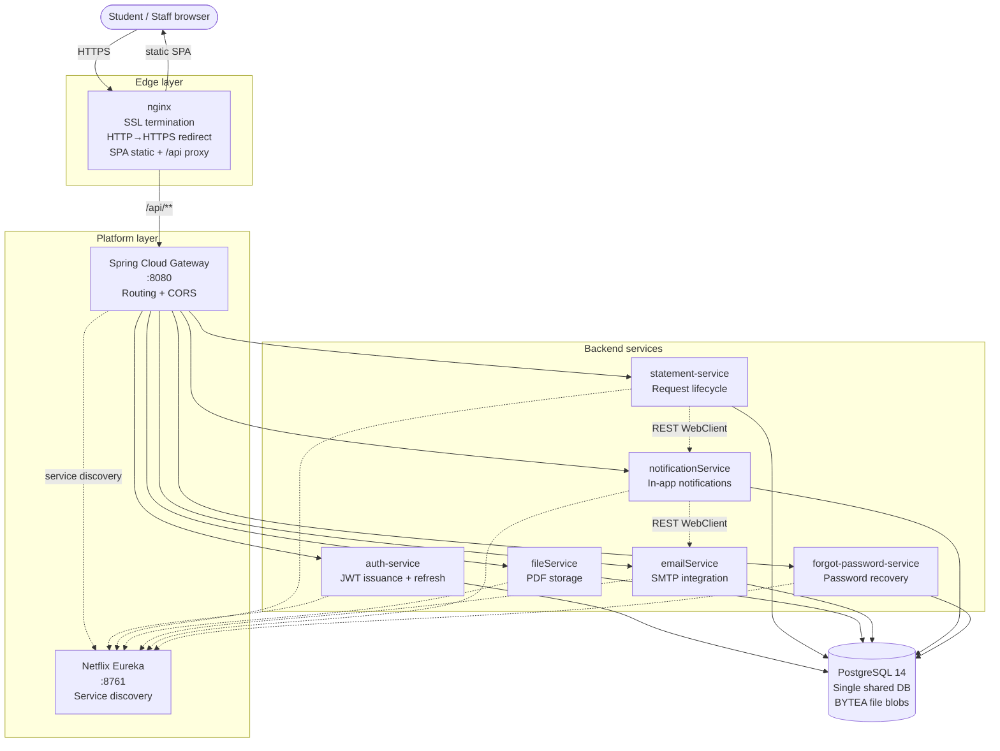

# Service System of LDUBGD

**Dean's Office Digital Services Platform**

A production microservices platform that consolidated every service the Dean's Offices at Lviv State University of Life Safety (LDUBGD) provide to students into a single online system. Replaces a fragmented mix of ad-hoc Telegram channels and physical walk-ins with one place where any student can submit any Dean's Office request and track it to completion.

🌐 **Live:** [dovidka.ldubgd.edu.ua](https://dovidka.ldubgd.edu.ua)


---

## Table of contents

- [The problem](#the-problem)
- [What it does](#what-it-does)
- [Architecture](#architecture)
- [Tech stack](#tech-stack)
- [Team and my contribution](#team-and-my-contribution)
- [Engineering decisions and trade-offs](#engineering-decisions-and-trade-offs)
- [Production rollout — lessons learned](#production-rollout--lessons-learned)
- [Known limitations and next iteration](#known-limitations-and-next-iteration)
- [Running locally](#running-locally)
- [Project status](#project-status)

---

## The problem

Before this project, students at LDUBGD requested everything the Dean's Office handles — academic certificates, password resets for the Virtual University and the gradebook, application forms, and various references — through scattered Telegram channels or by physically walking into the office.

There was no single system. Different Dean's Offices used different ad-hoc channels. Requests got lost. Staff burned hours every day on repetitive manual work. Students had no idea where to send what, or how to check whether their request was being processed.

The Dean's Office team approached us with a concrete operational pain. We spent the discovery phase sitting with the staff, mapped every service each Dean's Office actually provides, and unified them under one platform — a single place where any student from any faculty can submit any Dean's Office request, track its status, and receive the result digitally.

---

## What it does

**5 service types** (the full set of Dean's Office services covered today):

| # | Service | Type |
|---|---|---|
| 1 | Form 9 certificate (proof of enrollment for state institutions) | Certificate |
| 2 | Form 20 certificate (for the military registration office) | Certificate |
| 3 | Generic place-of-study certificate | Certificate |
| 4 | Virtual University password reset | Account recovery |
| 5 | Gradebook password reset | Account recovery |

**4 user roles:** `STUDENT`, `ADMIN`, `SUPER_ADMIN`, `TECH_ADMIN`.

**Student flow.** Authenticate → submit a request via a web form pre-filled with profile data → wait for status updates (`PENDING` → `IN_PROGRESS` → `READY`) delivered as in-app notifications and email → pick up the document.

**Dean's Office staff flow.** View the queue of incoming requests filtered by faculty, group, and request type → process the request in their existing offline workflow → mark as ready and upload the generated PDF → the student is notified automatically.

---

## Architecture



**10 deployable units:**

1. `gatewayService` — Spring Cloud Gateway (port 8080); routing, Eureka-aware load balancing, CORS
2. `serviceRegistry` — Netflix Eureka server (port 8761)
3. `auth-service` — registration, login, JWT issuance/refresh
4. `statement-service` — core business logic for the certificate request lifecycle
5. `fileService` — PDF storage (as `BYTEA` blobs in PostgreSQL)
6. `emailService` — outbound email integration (SMTP)
7. `notificationService` — in-app notifications, triggers email on status change
8. `forgot-password-service` — password recovery flow for university systems
9. `sql-initializer` — runs `schema-postgres.sql` and `data.sql` on startup
10. `frontend` — React 18 SPA served via nginx with TLS termination

**Routing model.** All client requests go through `nginx` → `/api/**` → Spring Cloud Gateway → backend services via Eureka discovery. Gateway uses `lb://servicename` URIs and `StripPrefix=1` to forward to backend.

**Inter-service communication.** REST over HTTP using `WebClient` (reactive) called synchronously via `.block()`. There is no message broker — the notification chain is `statement-service → notificationService → emailService`, all synchronous.

**Shared utilities.** A `utils` Maven module contains all JPA entities and `CryptoTool` (Hashids-based ID obfuscation in inter-service URLs). Every service imports `utils`, which is what makes the shared-database approach feasible — and which couples them tightly (see [Engineering decisions](#engineering-decisions-and-trade-offs)).

---

## Tech stack

**Backend**

- Java 17, Maven multi-module (10 modules)
- Spring Boot 3.3.8
- Spring Cloud 2023.0.5 — Gateway, Netflix Eureka client/server
- Spring Data JPA + Hibernate
- PostgreSQL 14 (single shared database)
- JWT — `io.jsonwebtoken:jjwt` 0.11.5 (issue/validate) + `com.auth0:java-jwt` 4.3.0 (decode helpers)
- Spring Security Crypto (BCrypt password hashing)
- SpringDoc OpenAPI 3 / Swagger UI
- Lombok
- Hashids (ID obfuscation in inter-service URLs)

**Frontend**

- React 18.3, Vite 5.4
- React Router 6, Axios 1.7
- Bootstrap 5.3 + react-bootstrap + mdb-react-ui-kit
- jwt-decode (client-side claim reading)
- ESLint 9

**Infrastructure**

- Docker + Docker Compose (10 containers including Postgres)
- nginx (SPA serving + TLS termination on TLS 1.2/1.3)
- Custom university-issued SSL certificate
- Deployed on-premises on university infrastructure

---

## Team contribution

This was a 2-person engineering team with a clean platform / product split.

### Serhii — platform and infrastructure

| Module | What it is |
|---|---|
| `gatewayService` | Spring Cloud Gateway: routing, Eureka integration, CORS, route configuration for all 6 backend services |
| `serviceRegistry` | Netflix Eureka server (standalone, no peer replication) |
| `sql-initializer` | DB schema + seed data — owned the **shared data model** for all services |
| `utils` | Shared Maven module: all JPA entities + `CryptoTool` for ID obfuscation |
| `fileService` | File storage and retrieval |
| `emailService` | Outbound SMTP integration |

Plus the entire **DevOps and deployment** track: `docker-compose.yml` for all 10 containers, nginx + SSL configuration, deployment to the university's on-premises servers, and post-launch troubleshooting in production.

### Pavlo — business logic and UX

| Module | What it is |
|---|---|
| `auth-service` | Registration, login, JWT issuance and refresh |
| `statement-service` | Core business logic: certificate request lifecycle |
| `notificationService` | In-app notifications, triggers downstream email |
| `forgot-password-service` | Password reset for university Virtual University and gradebook systems |
| `frontend` | React SPA — student, staff, and admin interfaces |

Plus UI design.

### Joint

System architecture decisions (the choice to go with microservices, the routing model, the shared-DB decision) and customer discovery sessions with Dean's Office staff were done together.

---

## Engineering decisions and trade-offs

This section covers the non-trivial decisions baked into the codebase, why they were made, and what I would change today. Owning these honestly is more useful than pretending the decisions were optimal — a senior engineer reading this code in 2026 will see them anyway.

### Why microservices for a small-user-base system?

The architecture choice was driven primarily by **academic context** (this was a diploma project where part of the evaluation was demonstrating proficiency with distributed systems) and **team workflow** (clean ownership boundaries between two developers).

For the actual production load (~20–30 active users out of ~3,000 with access), a Spring Boot monolith would have been simpler and more correct. The current setup is a distributed monolith (see [Known limitations](#known-limitations-and-next-iteration)) and I would not recommend this architecture for a system at this scale today.

### File storage as PostgreSQL `BYTEA` blobs

PDF certificates are stored in two tables: `file_info` (metadata) and `file_data` (`BYTEA NOT NULL`).

- **Why:** simpler infrastructure on the on-premises university server (no need for a separate object store like MinIO), simpler backups (a single `pg_dump` captures everything including files), and certificate files are small (typically <100 KB).
- **Trade-off:** database size grows linearly with file volume; no CDN; blob retrieval through JPA is slower than serving files from a dedicated store; migrating to object storage later requires a data movement step.
- **What I would change today:** S3-compatible object storage (MinIO for on-prem), with the storage key in `file_info` and the binary in the bucket.

### Single shared database with cross-service foreign keys

All 6 services connect to the same PostgreSQL instance and the same schema. The schema has **foreign keys that cross service boundaries** (e.g. `file_info.statement_id → statement_info.id`, `notification.statement_info_id → statement_info.id`, `statement.user_id → users.user_id`).

- **Why:** simpler for a 2-person team — no distributed transactions, no eventual consistency, one source of truth. The shared `utils` module containing all entity definitions made this approach natural.
- **Trade-off:** this is a **distributed monolith** — services cannot be deployed independently if the schema changes. The mechanical separation into multiple Spring Boot apps does not translate into independent evolvability, which is most of the point of microservices.
- **What I would change today:** either go full monolith (recommended for current scale) or commit to true database-per-service with event-driven synchronization via a broker.

### JWT validation — design vs implementation reality

The intended design was JWT validation in each downstream service. In practice, **only `auth-service` actually validates JWTs (when refreshing them)**. The other services have one of:

- a `JwtTokenFilter` class that exists but is never registered with Spring (`statement-service`, `forgot-password-service`)
- a `SecurityConfig` class that only configures CORS, not authentication (`fileService`)
- no security configuration at all (`emailService`, `notificationService`)
- the gateway itself does not validate either

**No `@PreAuthorize` / `@Secured` / `@RolesAllowed` annotations exist anywhere in the codebase.** A valid JWT is not actually required to call most endpoints — `userId` is taken from caller-provided request data without verification.

This is the single most important thing I would change. The clean design today: JWT validation as a `GlobalFilter` in Spring Cloud Gateway, propagating verified `userId` and `role` to downstream services as trusted headers, with `@PreAuthorize` on every protected controller method.

### Refresh tokens stored in `HashMap`

```java
// auth-service/JwtService.java
private final Map<String, String> refreshStorage = new HashMap<>();
```

- **Why:** worked for a single-instance deployment, and the limitation was never tested because we never scaled out.
- **Trade-off:** restarting `auth-service` invalidates every refresh token. Running multiple instances of `auth-service` would silently break refresh for any token issued by a different instance (no shared state).
- **What I would change today:** Redis with TTL = 30 days (matching `REFRESH_TOKEN_EXPIRATION_DAYS`).

### Synchronous inter-service communication via reactive `WebClient.block()`

`SendNotificationService` uses `WebClient` (reactive) but calls `.block()` to make it synchronous. The notification flow is fully synchronous: status change in `statement-service` → REST call to `notificationService` → REST call to `emailService` → SMTP send.

- **Why:** copied from a tutorial that used `WebClient`; `.block()` was added once we realized we needed sync semantics.
- **Trade-off:** if SMTP is slow, the entire chain blocks; if `emailService` is down, notifications fail with a `System.err` log and no retry; status updates that the student sees depend on an out-of-band mail provider being reachable in real time. Would have been simpler and more honest to use plain `RestTemplate`.
- **What I would change today:** event-driven architecture with Kafka or RabbitMQ. `statement-service` publishes a `StatementStatusChanged` event; `notificationService` and `emailService` consume independently with retries and a dead-letter queue.

### `CryptoTool` for ID obfuscation in inter-service URLs

When `notificationService` calls `emailService`, the statement ID is sent as a Hashids-encoded string (e.g. `?id=K3Yj4nBp9X` instead of `?id=42`).

- **Why:** to avoid exposing incremental primary keys in URLs (basic defense against ID enumeration).
- **Trade-off:** this is **obfuscation, not encryption**. Hashids decode deterministically given the same salt — anyone with the salt can recover all IDs. It provides the *appearance* of security without real protection.
- **What I would change today:** UUID public IDs as the canonical external identifier, with auth checks on resource boundaries doing the actual access control. Obfuscation should not be a substitute for authorization.

---

## Production rollout — lessons learned

We deployed in **May 2025**. The first weeks of running on real university infrastructure surfaced the issues below — none catastrophic, all instructive.

### Network egress and service exposure

We initially could not reach the application from the public internet. The university network has firewall rules and a NAT setup that required coordination with the IT department before traffic on the dovidka subdomain could reach our containers.

**Lesson:** for any on-prem deployment, validate the full public-routable path *before* the rest of the stack is "ready" — don't leave it for last. A working app that isn't reachable looks identical to a broken app.

### SSL/TLS certificates

We use a custom certificate (`dovidka.crt`) issued through the university's CA rather than Let's Encrypt — partly because dovidka is a private subdomain managed by university IT. The certificate lifecycle, renewal process, and trust chain caused several rounds of nginx misconfiguration before a clean handshake on TLS 1.2/1.3 was achieved.

**Lesson:** when not using Let's Encrypt automation, the renewal calendar and intermediate-cert handling become your problem. Document them or they will surprise you a year later.

### Notifications not delivered

Email notifications failed silently in early deployment. Root causes were a mix of:

- the synchronous chain (any latency in SMTP propagated up the call stack)
- missing or wrong SMTP credentials in the environment
- emails landing in spam folders for some recipients
- the synchronous architecture made every failure user-visible — when notifications were stuck, status updates looked stuck too

**Lesson:** notifications belong in an async queue, not on the request path. We chose otherwise; production paid the price.

### Auth not working at first deploy

JWT login broke immediately on first deployment. The `JWT_ACCESS_SECRET` and `JWT_REFRESH_SECRET` env variables weren't being propagated to the `auth-service` container — the `.env` file wasn't read in the way docker-compose expected.

**Lesson:** secret management via `.env` files is brittle. For anything past hobby-scale, use a real secret manager (Vault, AWS Secrets Manager, Doppler). The savings of "just use a `.env`" disappear the first time you debug a missing variable in production.

### UI/UX issues caught only on real users

Real students used flows in ways we hadn't anticipated — wrong error messages, confusing form states, missing validation. We patched reactively over the first weeks.

**Lesson:** even a minimal pre-launch usability test with 3–5 real users would have caught most of these. Engineers are bad at being users of their own software.

---

## Known limitations and next iteration

If this project were continued (it is currently fixed-scope post-defense), the priority list:

1. **Move JWT validation to the gateway** as a `GlobalFilter`, propagate verified user context to downstream services as trusted headers, and add `@PreAuthorize` on protected endpoints. *(Single most important change — see [Engineering decisions](#engineering-decisions-and-trade-offs).)*
2. **Pick one architecture honestly.** Either consolidate to a Spring Boot monolith (recommended for current scale), or commit to true database-per-service with an event broker.
3. **Replace the `HashMap`-based refresh token store with Redis.**
4. **Move file storage from PostgreSQL `BYTEA` to S3-compatible object storage** (MinIO for on-prem).
5. **Replace the synchronous `WebClient.block()` chain with Kafka or RabbitMQ events.** `statement → notification → email` becomes an event flow with independent consumers, retries, and DLQ.
6. **Add idempotency keys + unique constraints** on submissions to prevent duplicates from double-clicks. Today the frontend submit button is not disabled during the request, and the schema has no unique constraint on `(user_id, type_of_statement, created_at)`.
7. **Replace Hashids ID obfuscation with UUID public IDs** plus real authorization checks on resource boundaries.
8. **Add integration tests with Testcontainers.** Current test coverage is 0.
9. **Tighten CORS** — currently `allowed-origin-patterns: "*"` with `allow-credentials: true`, which should be scoped to the actual frontend origin.
10. **Move secrets out of `.env` files** into a real secret manager.
11. **Centralized logging.** Currently each service writes to its own stdout, accessed via `docker logs`.
12. **CI/CD pipeline.** Current deploy is manual (SSH + `docker compose pull`).

---

## Running locally

**Prerequisites**

- Java 17
- Maven 3.9+
- Docker + Docker Compose
- Node.js 20+ (for frontend dev mode only)

**Setup**

```bash
# 1. Clone
git clone https://github.com/Barabah26/service-system-of-LDUBGD.git
cd service-system-of-LDUBGD

# 2. Build all backend modules (installs `utils` to local Maven cache,
#    which is required by every service)
mvn clean install -DskipTests

# 3. Create `dockerConfig/.env` with the required variables
cp dockerConfig/.env.example dockerConfig/.env  # then edit
```

**Required `.env` variables**

```bash
# Database
DATABASE_NAME=ldubgd_crm
DATABASE_USERNAME=postgres
DATABASE_PASSWORD=changeme
DATABASE_PORT=5432

# Service discovery
EUREKA_SERVER_URL=http://service-registry:8761/eureka

# Service-to-service URLs (used by notification → email and email → file)
FILE_SERVICE_URL=http://file-service:8080
EMAIL_SERVICE_URL=http://email-service:8080

# Per-service ports (host-side)
FILE_SERVICE_PORT=8081
EMAIL_SERVICE_PORT=8082
NOTIFICATION_SERVICE_PORT=8083
AUTH_SERVICE_PORT=8084
STATEMENT_SERVICE_PORT=8085
FORGOT_PASSWORD_SERVICE_PORT=8086

# JWT secrets (must be base64-encoded HMAC-SHA-compatible keys)
JWT_ACCESS_SECRET=<base64 of >=32 random bytes>
JWT_REFRESH_SECRET=<base64 of >=32 random bytes>
JWT_SECRET=<base64 of >=32 random bytes>

# Hashids salt (for ID obfuscation in inter-service URLs)
SALT=<any string>

# SMTP (Gmail or any provider)
EMAIL_OF_EMAIL_SENDER=your.account@example.com
PASSWORD_OF_EMAIL_SENDER=<app password>
```

**Run**

```bash
cd dockerConfig
docker compose up -d
```

This brings up: PostgreSQL, Eureka, Gateway, all 6 services, and the React frontend. After ~30 seconds:

- Frontend: http://localhost
- Gateway: http://localhost:8080
- Eureka dashboard: http://localhost:8761
- Swagger UI per service: `http://localhost:{PORT}/swagger-ui.html`

The `sql-initializer` runs once at startup and creates all tables defined in `sql-initializer/src/main/resources/schema-postgres.sql`.

---

## Project status

Fixed-scope as of May 2025 (defended as a diploma project). Live in production at [dovidka.ldubgd.edu.ua](https://dovidka.ldubgd.edu.ua), currently rolled out to **2 of the university's faculties** with **~20–30 active users out of ~3,000 with access**. No active development; the system is maintained as-is.

This README documents the project as it exists, including the design decisions that did not age well, in the belief that an honest engineering record is more useful than a polished pitch.
